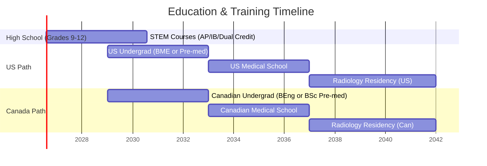

# Career & Education Paths: Biomedical Engineering vs Radiology (US vs Canada)

**Executive Summary:** *This report compares education and career pathways in biomedical engineering (BME) and radiology for a Canadian citizen studying in Kentucky. It contrasts degree programs, accreditation/licensure, market prospects, costs, and immigration factors in the US and Canada. Key findings:* Canadian study offers lower tuition (as a domestic student) and straightforward licensure, but fewer specialized BME programs and medical seats. U.S. study has many universities (public and private), strong research opportunities, and high salaries, but higher costs for an international student and complex visa/licensure hurdles. Medical (radiology) training requires a medical degree plus 4–5 year residency in either country. Tables below compare representative universities (engineering and medical), including tuition (domestic vs international) and living costs. We recommend taking rigorous STEM courses (AP/IB/dual credits) in high school【78†L140-L147】【74†L195-L200】, and carefully weighing factors like cost, mobility, and licensing. Timeline charts outline 4–6 year plans for US vs Canada paths.

## Academic Pathways (US vs Canada)

- **Biomedical Engineering (Undergrad/Grad):** In both countries a bachelor’s in engineering (BEng/BASc) is required, followed by optional graduate study (MEng/MSc, PhD). U.S. programs are ABET‐accredited; Canadian programs are accredited by Engineers Canada (CEAB)【66†L76-L80】. Many Canadian schools (e.g. McGill, Waterloo, UBC, McMaster) offer BME or related tracks. For example, McGill launched a Bioengineering BEng in 2020【37†L638-L642】; UBC offers Biomedical Eng courses within applied science. In Canada engineering degrees are *substantially equivalent* under the Washington Accord, as they are in the U.S. after ABET accreditation【66†L76-L80】. After a BME degree, graduates may work in industry or pursue graduate study. Canadian MEng/MASc students often receive stipends (e.g. UofT MASc stipend ~$20k/year【44†L165-L173】), whereas U.S. master’s often require tuition, but Ph.D. students typically receive funding.

- **Medicine → Radiology:** Radiology is a medical specialty, so the path is: **(a)** obtain an undergraduate degree with pre-med prerequisites, **(b)** enter medical school (4 years), **(c)** complete a radiology residency (4–5 years). In the US, medical schools are 4-year MD or DO programs (LCME-accredited) followed by 4 years of radiology residency (plus 1 year internship) accredited by ACGME【70†L0-L3】. Board certification is by the American Board of Radiology; physicians also need state licensure. In Canada, Canadian citizens must still complete 4-year MD (typically in Canada) and then a 5-year radiology residency certified by the Royal College (FRCP)【15†L139-L147】. Licensure is by provincial medical colleges. Notably, US residencies for Canadian grads require passing USMLE/ECFMG if done abroad; similarly, US-trained doctors need MCC exams to practice in Canada. *Typical timelines:* Undergrad (4y) + MD (4y) + Radiology residency (US:5y; Can:5y including internship).

## Accreditation and Licensure

- **Biomedical Engineering:** U.S. BME programs must be ABET-accredited (via the Engineering Accreditation Commission) for graduates to qualify as Professional Engineers (PE) in most states. Canada requires CEAB-accredited BEng degrees for P.Eng licensing【66†L76-L80】. In both countries, engineer licensing requires: accredited degree, work experience (1-4 years), and exams (Fundamentals of Engineering (FE) + Principles & Practice PE in US; Professional Practice Exam in Canada). Engineers Canada notes that accredited programs “provide the academic requirements for licensure as a professional engineer”【66†L76-L80】. Graduates can work in either country, as ABET/CEAB are recognized under the Washington Accord, facilitating cross-border licensure.

- **Radiologists (MD):** An MD degree and residency are mandatory. In the U.S., medical schools are accredited by LCME, and radiology residencies by ACGME【70†L0-L3】. After residency, radiologists must pass the ABR exam and hold a state medical license. In Canada, accredited MD programs and Royal College residencies are required; after residency the FRCP(C) in Radiology is awarded. Physicians then must be licensed by their provincial colleges. (For example, Canadian med grads must write the MCC exams.) Pathway differences: Canadian citizens in US can obtain medical licensure by fulfilling US requirements (residency, exams), but many Canadian med schools prefer admitting domestically schooled applicants. Conversely, US citizens wanting to practice in Canada must write MCC exams and often complete residency in Canada.

## Career Outlook and Job Market

- **Biomedical Engineering:** The U.S. Bureau of Labor Statistics (2024) reports **median pay** for biomedical engineers of **$106,950/year**【1†L264-L268】, with job growth ~5% (2024–34)【1†L269-L273】. Major employers include medical device and biotech firms (e.g. Medtronic, Abbott, GE Healthcare, Johnson & Johnson) as well as hospitals and research labs. In Canada, the Job Bank reports a **median wage** of about **$50 CAD/hour**【5†L81-L84】 (~$104,000/year) for biomedical engineers, with similar technical roles found at companies like Philips, Siemens Healthineers, and smaller startups. Canadian BME professionals often work in R&D, quality assurance, or clinical engineering within hospitals. Job prospects are good in both countries, though Canada’s smaller market means fewer positions, and many engineers enter related fields (electrical, software) as well. Research opportunities (e.g. NIH or CIHR-funded labs) exist in both countries, often tied to universities or national institutes.

- **Radiology:** Radiologists are among the highest-paid physicians. In the U.S., the **mean salary** for radiologists was **$354,000** (2023)【9†L259-L267】 (with many earning $300k+), and growth is modest (~3%)【13†L488-L492】. Employment is predominantly in hospitals, imaging clinics, and academic medical centers. In Canada, the median annual income is **$311,000 CAD**【11†L180-L188】. A 2013 analysis noted Canada had ~2100 radiologists with 50–60 new grads entering the workforce each year【15†L139-L147】; this tight supply means jobs are concentrated in urban centers and larger hospitals. Research roles (e.g. MRI development) typically occur at academic health sciences centers or institutes. *In summary:* Both fields offer high salaries, but radiologists’ income is much higher than engineers. Demand for radiologists can be constrained by healthcare budgets (e.g. government fee changes【15†L139-L147】), whereas biomedical engineers have broader industry opportunities.

## Programs & Costs (Examples)

| **University (Program)**             | **Country (Type)**        | **Undergraduate Tuition (Annual)**             | **Grad/Professional Tuition**            |
|--------------------------------------|---------------------------|-----------------------------------------------|-----------------------------------------|
| Univ. of Waterloo (BEng Biomedical)  | Canada – Public           | ∼$19,000 (ON-resident) / $75,000 (intl)【47†L13-L16】 | (N/A undergrad; MEng/MASc domestic ~$8k–$15k【44†L150-L157】; PhD funding typically $30–40k/yr) |
| UBC Vancouver (BASc Biomedical)      | Canada – Public           | ~$8,200 (domestic)【55†L191-L195】 / ~$66,200 (intl)【55†L231-L238】 | MD program: $21,219 (domestic) / *n/a* intl; (MEng domestic $5k, intl $35k) |
| Univ. of Toronto (MASc BME)          | Canada – Public           | – (“grad only”)                              | MEng: $15,618 (dom) / $73,760 (intl)【44†L150-L157】; MASc: $8,448 (dom) / $34,900 (intl)【44†L177-L184】 |
| Univ. of Michigan (BSE Biomedical)   | US – Public               | ~$25,000 (in-state) / ~$68,000 (out-of-state)【59†L107-L110】 | (Master’s ~$25k/yr; PhD funded ~tuition+stipend)         |
| UT Austin (Cockrell, BME)            | US – Public               | ~$82,000 (TX-resident) / ~$95,000 (nonres.)【61†L389-L397】 | MD (Dell Med): $22,074 (resident) / $37,138 (nonres.)【61†L369-L377】 |
| MIT (Course 2, BME concentration)    | US – Private              | ~$100,000 (flat tuition; ~$33,360/term【87†L349-L353】) | PhD funded (tuition + stipend ~$40k)                   |
| U. of Toronto (MD Program)          | Canada – Public           | N/A (medical program)                        | $23,090 (ON-domestic) / $97,350 (int'l)【80†L188-L196】 (per year) |
| Harvard Univ. (MD)                  | US – Private              | –                                             | ~$68,000 (year) tuition (2025–26) [US med school avg]  |
| Stanford Univ. (MD)                 | US – Private              | –                                             | ~$65,000 (year) tuition (typical US med)              |

*Notes:* **Undergraduate:** Figures are approximate 2025‑26 tuition (CAD or USD) excluding fees. “Domestic” means Canadian citizens (for Canada) or in-state (for public US); “Intl” means foreign student. Canadian domestic tuition is generally 5–10× lower than international【47†L13-L16】【55†L231-L238】. **Professional/Grad:** Canadian MD tuition is very low for citizens (≈$20–30k/yr【80†L188-L196】) vs very high in the U.S. ($50–70k/yr). Canadian master’s (MSc/MEng) often have subsidized tuition + stipend, while U.S. master’s usually full tuition unless researcher’s. Living costs are additional: roughly $12,000 CAD/yr in Canada【64†L391-L400】 versus ~$15–20k USD in the U.S. (varies by city).

## Visa & Immigration

- **Studying in the US (Canadian citizen):** Canadians **do need** F-1 student status (I-20) for US university attendance, but are visa-exempt (no embassy stamp)【73†L21-L24】. After graduation, F-1 graduates may use Optional Practical Training (OPT) for up to 12 months (plus 24-month STEM extension). Long-term work requires H-1B (cap limit, lottery) or TN under USMCA (TN visas for “Engineers” etc【15†L139-L147】). Path to U.S. permanent residency (Green Card) is typically employment-based; TN itself does not lead to GC. **Implication:** As a Canadian, she cannot pay in-state tuition, and must navigate the F-1 → OPT/H1B process or TN status (TN could apply to biomedical engineers as “engineer” profession) if staying in the US workforce. Becoming a US-licensed physician is difficult: Canadian MDs/Residency can obtain US license via USMLE/Educational Commission (loophole program), but competing for U.S. residency slots is challenging for Canadians.

- **Studying in Canada:** As a Canadian citizen, there is no immigration hurdle. She’s a domestic student (tuition advantage) and retains full rights to work in Canada. No study permit is required, and upon graduation she automatically has the right to work in Canada without PGWP. (If she were an international, Canada offers a Post-Graduate Work Permit (up to 3 years) and relatively fast paths to PR.) Choosing Canadian schools keeps all training and licensure within the domestic system, simplifying the route to P.Eng or medical/specialty licensure. 

| **Process**                 | **Canada (citizen)**            | **USA (Canadian citizen)**              |
|-----------------------------|---------------------------------|-----------------------------------------|
| University admission        | Domestic applicant             | International applicant (I-20 needed)    |
| Tuition                     | Domestic (low)                 | International (high)                    |
| Post-degree work permit     | Not needed (citizen)           | OPT (1-3 yrs, STEM)                      |
| Work visa (long-term)       | N/A (citizen)                  | H-1B/TN (USMCA)                          |
| Path to permanent residency | Already citizen                | Employer sponsorship or family          |

## Credit Transfer & High School Preparation

- **Dual Credit (JCTC PLTW):** The JCTC Project Lead The Way (Biomedical Sciences) college credits may transfer like any community college credit. Canadian universities assess transfer credit case-by-case. In practice, universities (especially in Ontario/BC) readily grant credit for AP/IB, and often for US college courses. For example, **UBC grants 1–2 first-year credits for AP scores ≥4**【74†L195-L200】. We advise preserving transcripts of all dual-credit courses and AP exams, and consulting admissions offices early. Taking AP or IB courses in high school will maximize transfer credit. 

- **Recommended High-School Coursework:** Take the most rigorous STEM curriculum available. This includes **AP/IB Biology, Chemistry, Physics, and Calculus**【78†L140-L147】, as well as strong English and math. U.S. prep for engineering might emphasize AP Physics (C) and Calculus AB/BC; for pre-med, AP Biology/Chem and Statistics are key【78†L140-L147】【76†L81-L89】. Dual enrollment (as she is doing) can also simulate college science courses. Additional beneficial courses include AP Psychology/Sociology (for medicine) and languages (French is useful for Canadian healthcare)【76†L114-L122】【78†L140-L147】. Extracurriculars (science clubs, volunteering, research internships) strengthen medical school applications. Overall, aim for high GPA in honors/AP classes to meet admission requirements in both countries【78†L140-L147】.

- **Maximizing Transfer:** To facilitate credit transfer, she should:
  - Get official college transcripts from JCTC.
  - Score well on AP exams (4–5) for BC/ON uni credit【74†L195-L200】.
  - Ensure courses align with university prerequisites (e.g. English 4, senior math/science).
  - Contact admissions/transfer counselors at target Canadian universities (e.g. Waterloo, UofT) with her course list to pre-assess credit. Many institutions will grant credit for introductory courses (English, calculus, general biology) if content matches.

## Risks, Pros/Cons, and Decision Factors

- **Cost:** U.S. degrees (as an international student) are much more expensive than Canadian degrees for a Canadian citizen【47†L13-L16】【55†L231-L238】. A 4-year BME in the U.S. could exceed $200k, whereas Canadian engineering costs ~$20–80k【47†L13-L16】. Med school in the U.S. costs $200k+ (private) vs ~$80k-$120k in Canada (for Canadians)【80†L188-L196】. However, U.S. PhD positions are often fully funded, and U.S. employers may offer higher salaries.

- **Mobility and Licensing:** A U.S. engineering degree is accepted in Canada (and vice versa) due to the Washington Accord; however, licensure exams must still be taken in the country of practice. For medicine, a Canadian-trained MD can apply to U.S. residencies (with additional exams), but most Canadian students attend Canadian medical schools to maximize match chances. Staying in one country avoids cross-border licensing issues. If she plans to practice in Canada (as radiologist), studying in Canada is simpler. If she plans to live/work in the U.S. long-term (especially as an engineer, where TN visa is an option), a U.S. education may help her network and meet visa requirements.

- **Research & Clinical Exposure:** U.S. programs often have more research funding (NIH, NSF), larger faculty, and state-of-the-art facilities in engineering and medicine. Canadian universities also have high-quality research but generally smaller scale. Clinical training is robust in both (U.S. med students rotate in large teaching hospitals; Canadian students likewise in Canadian hospitals). Canadian healthcare offers more uniform patient demographics, while the U.S. system may offer more elective specialties. For biomedical engineering, the U.S. has a larger medical device industry (especially in biotech hubs), whereas Canada has a smaller but growing medtech sector.

- **Admissions Competitiveness:** Canadian medical schools are very competitive (often requiring MCAT and high grades). U.S. medical schools accept international applicants but are extremely selective (and Canadian citizen spots are very limited). A Canadian citizen often finds admission easier at home (domestic quota) than as a foreigner in the U.S. For engineering undergrad, both countries admit high achievers; AP/IB scores will enhance admission chances. 

- **Personal Factors:** Quality of life, cultural fit, and long-term goals matter. Studying in the U.S. means being away from home and handling visa renewals; studying in Canada means being a domestic student with family support. If the goal is to work in one country, training there is generally more straightforward. 

## 4–6 Year Plan (US vs Canada)

Below is an illustrative timeline for the next steps (assuming high-school graduation ~2029). It splits a **US pathway** vs **Canada pathway** for engineering or radiology:

- **US Path (Engineering):** Enter a U.S. university (BME) in 2029. Complete 4-year BEng (with internships). Optionally pursue MEng/MSc/PhD (funded) or start a job in 2033+.

- **US Path (Radiology):** After undergrad (2029–33), attend U.S. medical school (2033–37). Then 4-year radiology residency (2037–41). After fellowship (optional 1-2y) complete.

- **Canada Path (Engineering):** Start a Canadian engineering degree (2029–33). After 4 years, work or graduate school.

- **Canada Path (Radiology):** Undergrad (2029–33) → Canadian MD (2033–37) → 5-year radiology residency (2037–42).

## Conclusion

Both paths can lead to rewarding careers, but the **best choice depends on priorities**. If minimizing debt and staying in Canada is key, pursuing education in Canada (cheap tuition, familiar system) is advantageous. If she seeks a wide array of program choices, cutting-edge research, and possibly U.S. employment (with higher salary potential, despite visa hurdles), an American education may appeal. Weigh **cost vs opportunity, licensing ease, and personal goals**. Early preparation (AP/IB courses, maintaining top grades, research/volunteer experience) will keep options open on both sides of the border.

**Sources:** Official data from government labor and immigration sites, university websites, and accreditation bodies【1†L264-L268】【5†L81-L84】【11†L180-L188】【55†L183-L191】【59†L107-L110】【80†L188-L196】【73†L21-L24】【78†L140-L147】.
