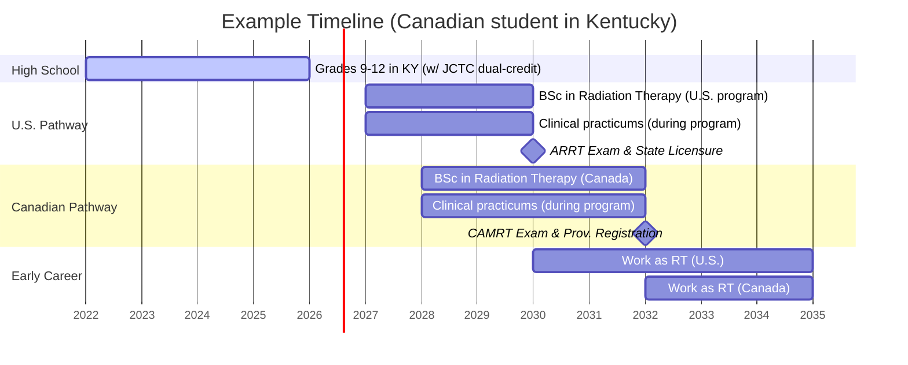

# Executive Summary  
**Radiation therapy** requires specialized postsecondary education and certification in both the U.S. and Canada. In the U.S., aspiring radiation therapists complete an ARRT-accredited program (typically a 2–4 year associate or bachelor’s degree) and pass the ARRT exam【78†L251-L259】; most states then issue a professional license. In Canada, one typically completes a 3–4 year medical radiation technology diploma or BSc in Radiation Therapy (accredited by CAMRT), then writes the CAMRT certification exam and registers provincially (e.g. with Ontario’s CMRTO)【28†L274-L282】. Educational pathways in both countries include extensive clinical practicum. 

For a **Canadian citizen studying in Kentucky**, the tradeoffs are: 

- **Education & Certification:** U.S. programs (e.g. the Bachelor’s program at Northern Kentucky University【33†L86-L94】) often admit students after high school and include ARRT exam eligibility. Canadian programs (e.g. the UAlberta 4‑year BSc【52†L486-L492】 or college diplomas) give direct CAMRT eligibility. ARRT-certified U.S. technologists cannot directly register in Canada without writing the CAMRT exam, and likewise CAMRT certification isn’t recognized for U.S. licensure. 
- **Cost:** U.S. tuition is much higher for international students.  For example, NKU’s full-time international undergraduate tuition is ~$15,000/yr (plus ~$30k cost of attendance including living)【43†L100-L109】. In contrast, Canadian (domestic) tuition is far lower: UAlberta tuition is only ~$3,200/term (~$8–9k/yr) for residents【52†L486-L492】. Living costs in the U.S. Midwest (e.g. Louisville) are roughly 20–25% lower than major Canadian cities like Toronto【75†L39-L47】. 
- **Visa & Work:** A Canadian can study in the U.S. on an F‑1 student visa (no visa stamp needed) with access to CPT/OPT for training.  Post-graduation, OPT (12 months) is available, but longer-term U.S. work requires obtaining an H‑1B or similar (TN status is not available for radiation therapists). Returning to Canada is simpler: as a citizen she needs only to meet the licensure requirements (CAMRT exam, provincial registration) to work. Canadian citizens studying in Canada require no visa, and have full work rights on graduation. Canadian student loans and grants can fund studies abroad if the U.S. school is designated【69†L113-L122】, whereas as a Canadian student in Canada she would use domestic loans/scholarships (e.g. CAMRT-related awards【71†L317-L325】). 
- **Credit Transfer:** JCTC dual-enrolled PLTW credits are bona fide college credits in Kentucky. In-state Kentucky institutions (like NKU) will accept them; their transfer to Canadian colleges is not automatic. Canadian universities assess U.S. college credits case-by-case. The PLTW program notes that students can earn college credit opportunities【76†L86-L94】, but Canadian schools have no standard policy. In practice, she would request a course-by-course evaluation of her JCTC transcripts/syllabi at each Canadian institution (e.g. Ontario’s Transfer Guides, BC’s Transfer Guide, or Alberta’s PLAR system). Some general education credits (biology, English, etc.) may transfer, but specialized healthcare credits may not. 

**Recommendation:** If her goal is to work in Canada eventually, studying in Canada (as a domestic student) offers lower tuition, simpler licensure (CAMRT exam only), and no immigration hurdles. If she prefers the U.S., she must plan for international tuition rates, an F‑1 visa, ARRT certification, and later U.S. work authorization (OPT/H‑1B) and then re-qualification in Canada via CAMRT. A detailed timeline and table comparison follow.  

## Education & Accreditation Requirements  

- **United States:**  Radiation therapy programs are accredited by the Joint Review Committee on Education in Radiologic Technology (JRCERT).  Graduates must have an *associate’s degree or higher* and complete a JRCERT/ARRT-approved program【78†L251-L259】. Program lengths are typically 2–4 years (many associate programs are ~2.5 years; bachelor’s programs ~4 years).  Students complete didactic courses in anatomy, physics, oncology, and ~1,000 clinical hours.  After graduation they take the ARRT Radiation Therapy certification exam.  (Example: Northern Kentucky University offers a Bachelor of Science in Radiation Therapy【33†L86-L94】, admitting students after pre-req courses and graduating them in ~4 years with ARRT eligibility.)  

- **Canada:**  Programs are approved by the Canadian Medical Association (CAMRT) and provincial bodies.  They are usually 3–4 year college diplomas or university BSc programs.  For example, UAlberta’s BSc in Radiation Therapy is a 4‑year program (with Year 1 being pre‑professional)【53†L1-L4】【52†L486-L494】; BCIT offers a 33‑month BSc; Mohawk College offers a 3‑year BSc with McMaster.  Programs include clinical placements. Graduates are eligible to write the national CAMRT certification exam. 

- **Curriculum & Clinical Placements:**  Both countries’ programs emphasize hands-on clinical practicum under supervision.  Programs end with a practicum block or co-op, typically totaling hundreds of clinical hours. In the U.S., schools submit a clinical competency report to ARRT upon completion. In Canada, programs must meet CAMRT standards and arrange mandatory practicums (often 50–60 weeks of placement). 

- **Accreditation:**  ARRT-approved/U.S. programs are often at community colleges or universities (e.g., JRCERT accredits >60 RT programs nationwide).  Canadian programs must be accredited by provincial or national bodies (CAMRT recognition, or in Quebec, approval by Québec’s OIQIM-M). Graduating from an accredited program is a requirement for exam eligibility in both countries. 

## Certification, Licensing & Scope of Practice  

| Aspect               | United States (ARRT)                                   | Canada (CAMRT)                                        |
|----------------------|--------------------------------------------------------|-------------------------------------------------------|
| **Credential**       | ARRT Radiologic Technologist (RT) in Radiation Therapy【78†L251-L259】 | Certified Medical Radiation Technologist (MRT(T))【28†L274-L282】 |
| **Academic Req’t**   | Associate’s degree (or higher) + ARRT‑accredited program【78†L251-L259】 | Bachelor’s or diploma from accredited program (citizenship or PR often required) |
| **Certification Exam** | ARRT national exam (after graduation)【78†L251-L259】         | CAMRT national certification exam (after graduation)     |
| **State/Provincial License** | Required by most states (administrated at state level, usually requiring ARRT) | Required in most provinces: must register with provincial college (e.g. CMRTO in Ontario) by exam【28†L274-L282】 |
| **Continued Education** | ARRT requires 24 CE credits biennially (and ethics)      | CAMRT requires continuing professional development (100 CPD credits/5yr, CPR) |

- **US Licensing:**  ARRT certification is required for licensure in virtually every U.S. state. States may have additional requirements (e.g. background checks), but completion of an ARRT-certified program and passing the ARRT exam is universally mandatory【78†L251-L259】. Technologists renew ARRT certification every 2 years. Scope of practice in the U.S. is defined by state law; typically a radiation therapist “administers prescribed radiation treatments” under an oncologist’s supervision【33†L88-L94】, similar nationwide. 

- **Canadian Licensing:**  In Canada, CAMRT certification plus provincial registration is required to practice. For example, Ontario’s College of Medical Radiation Technologists (CMRTO) mandates completion of a recognized program *and* passing the CAMRT exam【28†L274-L282】. Other provinces (e.g. BC by 2028) have similar colleges. CAMRT membership is required to sit the exam. As in the U.S., Canadian radiation therapists deliver radiation treatments per physician orders. (Notably, ARRT credentials alone do *not* grant Canadian license; an ARRT-certified person must still meet CAMRT/provincial requirements.)

- **Scope Differences:**  The day-to-day scope is broadly comparable: imaging patient setup, delivering radiation, monitoring patients, and collaborating with oncology teams. Specific allowed tasks (e.g. advanced imaging use) may vary slightly by region, but generally there is no large practice gap between the countries.

- **Career Path:**  After initial certification, technologists in both countries can advance via specialization (e.g. in CT planning), management, or further education (e.g. medical physics or radiation oncology residencies for M.Sc./Ph.D. paths). Bilingual or advanced training may open leadership roles. 

## Job Market, Demand & Salaries  

- **United States:**  The BLS projects ~7% growth for radiation therapists through 2032 (about as fast as average)【57†L264-L269】. In 2024 the median U.S. wage was about **$98,300** per year【57†L264-L269】 (Kentucky-specific median ~ $90–91k【55†L6-L9】). Employers include hospitals (general and cancer centers), outpatient clinics, and research institutions.  

- **Canada:**  CAMRT reports significant staffing shortages in radiation therapy (vacancy rates rising) across provinces. Surveys and news have highlighted “workforce crisis” concerns. Salaries are roughly C$80–90k annually. Indeed Canada reports an average of **$46.11/hr** (~C$95k/year)【59†L52-L54】. Provincial variations exist: e.g. starting in BC ~C$37/h (C$77k) to about C$46/h (C$96k) for top rates. Demand is high in Atlantic and rural regions (some provinces offer recruitment incentives). 

*Table 1. Education and Accreditation Comparison (U.S. vs Canada)*  

| Feature                | United States (ARRT Path)                       | Canada (CAMRT Path)                                   |
|------------------------|-----------------------------------------------|-------------------------------------------------------|
| **Program Types**      | Associate’s (AAS) or Bachelor’s degree in RT (2–4 yrs)【78†L251-L259】 | Diploma/Advanced Diploma or BSc in Radiation Therapy (3–4 yrs)【53†L1-L4】【52†L486-L494】 |
| **Accreditation**      | JRCERT accreditation (ARRT-approved program)     | CAMRT-approved program (some provinces require approval)  |
| **Typical Duration**   | ~2–4 years (plus prerequisites if needed)       | 3–4 years (often including clinical co-op terms)         |
| **Entry Exam**         | ARRT Certification Exam in Radiation Therapy     | CAMRT Entry-to-Practice Exam (MRT(T))                   |
| **Clinical Placements**| Required (1000+ hours) as part of program       | Required (mandatory practicums 1–2 years’ worth)         |
| **Professional License**| State license (via ARRT cert)                 | Provincial registration (via CAMRT cert)【28†L274-L282】  |
| **Continuing Ed.**     | ARRT CE requirement (24 credits/2yr)           | CAMRT CPD (100 credits/5yr) + Provincial CPR test       |
| **Scope**              | Radiation oncology treatments (per presc.)     | Same (varies by province), plus patient care counseling  |
  
## Cost Comparison (Tuition, Fees, Living)  

| **Category**                 | **U.S. – Kentucky (example)**                 | **Canada (example)**                                |
|------------------------------|----------------------------------------------|----------------------------------------------------|
| **Tuition (in-state)***      | –                                            | $8–10K CAD/yr (e.g. UAlberta domestic)【52†L486-L494】 |
| **Tuition (out-of-state)**   | ~$15K USD/yr (e.g. NKU)【43†L100-L109】         | ~$30K CAD/yr (international; irrelevant for citizens)  |
| **Room/Board (annual)**      | ~$15–20K USD (Louisville area)               | ~$15–20K CAD (e.g. Toronto/CALG area)【75†L39-L47】    |
| **Total Cost (yr1)**        | ~$30K USD (incl. tuition+fees+living)【43†L100-L109】 | ~$23–28K CAD (tuition + living)                      |
| **Scholarships/aid**        | Canadian student loans/grants *may* apply (if school is designated)【69†L113-L122】; PLTW/ARRT scholarships | Federal/provincial loans/grants (for citizens) + CAMRT scholarships (e.g. belairdirect)【71†L317-L325】 |
| **Estimated Living Difference** | Louisville cost ~25% lower than Toronto【75†L39-L47】 | (Major cities in Canada more expensive; rural less so) |

*Notes:* Kentucky in-state rates may apply to an F-1 Canadian if she completes high school in KY (per NKU policy)【43†L125-L133】; otherwise international rates (~$30K/yr total attendance) apply. Canadian citizens always qualify as domestic (low) tuition in Canada. Costs vary by institution; examples above use NKU (KY) and UAlberta.

## Visa & Immigration Considerations  

- **Studying in the U.S.:** As a Canadian citizen, she needs an F‑1 student visa (or study permit), which for Canadians is usually straightforward (no U.S. visa stamp needed, but I-20 required). On F-1 she can work on-campus and do CPT (internships) or OPT (12 months post-graduation work authorization)【69†L113-L122】. After OPT, long-term U.S. employment would require employer sponsorship (H-1B) or other status (TN is *not* available for RT jobs). 

- **Working in the U.S. after U.S. education:** She would hold ARRT certification and state license (as required).  However, securing an H‑1B is competitive and radiation therapist is not a listed NAFTA professional. Some hospitals sponsor H‑1B for allied health, but it is not guaranteed.  

- **Working in Canada after U.S. education:** As a citizen, she can return freely. She must obtain Canadian licensure: likely by contacting CAMRT and her provincial regulator. If her U.S. degree is not a CAMRT-accredited program, she would apply as an “international graduate,” potentially completing a bridging program or just taking the CAMRT exam (Provincial colleges will assess). She could also pursue examination equivalency (e.g. Ontario’s CMRTO allows CAMRT exam instead of its own). 

- **Studying in Canada:** No visa needed. After graduation, as a Canadian citizen she can begin work immediately upon passing CAMRT exam and registering provincially. Canadian employers generally have no immigration barrier for citizens.  

## Transfer of JCTC PLTW Dual Credits  

JCTC’s PLTW biomedical sciences credits are established college credits. Kentucky public universities will accept them for required courses【63†L129-L136】, but Canadian acceptance is case-by-case. Canadian institutions do not automatically grant credit for U.S. dual-enrollment courses; instead: 

- **Process:** The student must apply to the Canadian college/university, submitting official transcripts and detailed course descriptions/syllabi from JCTC. Admissions or transfer credit offices will evaluate them. Possible credit might be granted for general courses (e.g., English, Calculus, Biology) but specialized or PLTW-specific courses (like Medical Intervention) may only count as electives. Some provinces (e.g. BC) have transfer systems (BC Transfer Guide) that may assist, but PLTW courses generally aren’t listed.  

- **Likely Institutions:** Provincial “transfer-friendly” schools (e.g. University of Toronto collaborative programs, Alberta universities, BC colleges) will consider credit requests. For example, Ontario has the OCAS transfer credit guides, and Alberta has “Prior Learning Assessment.” Mohawk College/McMaster (ON) and UAlberta (AB) are known programs. She should check with program advisors early (e.g. Mohawk-McMaster’s credit recognition policies, UAlberta’s transfer credit offices). 

- **Outcomes:** Even if no formal credit is granted, the experience may strengthen her application. At minimum, submitting dual-credit transcripts can accelerate program entry (satisfying prerequisites). 

## Comparative Timeline  

Below is an illustrative timeline comparing a U.S. vs Canada pathway:

*Note:* The chart above is an example. If she goes U.S., she might graduate ~2030 (assuming immediate college start). If she finishes HS in 2026, a Canadian 4-yr degree might end ~2030 as well. Actual dates depend on program choices and possible gap years.

## Decision Factors  

- **Cost/Finances:** Canada offers much lower tuition for her as a citizen. U.S. study means paying international rates (unless she qualifies for in-state via residency rules). Even with Canadian loans, covering U.S. tuition is challenging【69†L113-L122】.  

- **Licensure Strategy:** If she intends to work in Canada, studying in Canada streamlines certification. U.S. study means extra steps to qualify in Canada. Conversely, if she prefers to work in the U.S., she *must* study in the U.S. (since Canadian credentials aren’t ARRT-approved) and obtain appropriate visas.  

- **Program Availability:** Very few U.S. schools outside Kentucky offer RT, but Kentucky’s NKU does. Canada has numerous programs coast-to-coast (see CAMRT list【21†L1-L4】). Access to different campus environments and specializations may influence choice.  

- **Immigration Flexibility:** As a Canadian, staying in Canada removes immigration worry. Studying in the U.S. is doable but obtaining long-term U.S. work rights (beyond OPT) is uncertain.  

- **Credit Utilization:** Her JCTC credits will definitely help in Kentucky programs (and possibly reduce U.S. course load)【63†L129-L136】. They may have limited value in Canada but could still accelerate general education requirements.

## Tables of Key Comparisons  

**Table 2. Educational/Career Pathway Comparison**  

| Point of Comparison         | U.S. Pathway                            | Canada Pathway                          |
|-----------------------------|-----------------------------------------|-----------------------------------------|
| **Credential Earned**       | AAS/BS in RT (ARRT-eligible)            | Diploma/BSc MRT(T) (CAMRT-eligible)     |
| **Length**                  | 2–4 years (plus prerequisites)          | 3–4 years                               |
| **Exam & License**          | ARRT cert. exam → State RT license      | CAMRT exam → Provincial registration     |
| **Tuition (citizen)**       | ~(US)$30k/yr (int’l rate)【43†L100-L109】 | ~C$9k/yr (domestic)【52†L486-L494】      |
| **Living (on-campus)**      | ~$15k/yr (mid-$20k with off-campus)      | ~$15–20k CAD/yr                        |
| **Financial Aid**           | Canadian loans *possible*【69†L113-L122】 | Canadian loans/grants fully available  |
| **Work After Grad (visa)**  | F-1 OPT 12mo; H-1B possible (competitive) | Citizen – no visa needed               |
| **Geographic Flexibility**  | Can practice in U.S. (if licensed); returning to Canada needs CAMRT exam | Can practice anywhere in Canada; moving to U.S. requires new cert & visa |
  
**Table 3. Costs and Requirements Summary**  

| Category                     | U.S. (Kentucky Example)                 | Canada (Example)                   |
|------------------------------|-----------------------------------------|------------------------------------|
| **Tuition (per year)**       | ~$11k (in-state) / $15k (out-of-state)【43†L100-L109】 | ~$8–10k (domestic); ~$30k (int’l)  |
| **Room/Board (annual)**      | ~$15–20k                                | ~$15–20k (large city)             |
| **Total Cost (4-year)**      | ~$120k (int’l)                          | ~$36k (domestic)                  |
| **Certification Exam Fee**   | ~$200 (ARRT)                            | ~$445 (CAMRT)                     |
| **Regulatory Fees**          | ~$100–200/yr (state licensing)          | Varies by province (~$100–300/yr) |
| **Visa**                     | F-1 Student Visa                        | None (citizen)                    |
| **Work Authorization**       | OPT 12 mo (F-1), H-1B/TN for later      | Automatic (citizen)               |

**Table 4. Licensure Certification Comparison**  

| Aspect             | U.S.                                          | Canada                                    |
|--------------------|-----------------------------------------------|-------------------------------------------|
| **Initial Cert.**  | ARRT (national) + State license【78†L251-L259】 | CAMRT (national) + Provincial license【28†L274-L282】 |
| **Maintaining**    | ARRT renewal 2yr (CE+Ethics)                 | CAMRT CPD cycle (CPD credits)             |
| **Mobility**       | ARRT allows practice in any state (plus state req.) | CAMRT allows nationwide practice (provincial reg needed in each) |
| **Cross-Recognition** | Canadian MRTs must get ARRT by taking U.S. accredited program. ARRT-cert U.S. MRTs must take CAMRT exam in Canada. | 

## Open Questions / Limitations  

- **Credit Transfer Specifics:** Exact credit acceptance will vary by Canadian institution and is not standardized. The student should consult target schools’ transfer offices.  
- **Long-Term U.S. Work:** The analysis assumes difficulty obtaining H‑1B visas for medical technologists; actual prospects vary by employer.  
- **Salary Figures:** Salaries fluctuate by region, union vs non-union, and institution (hospital vs clinic). Figures provided are median estimates.  

**Sources:** ARRT and CAMRT official sites【78†L251-L259】【28†L274-L282】【21†L1-L4】; NKU program and tuition info【33†L86-L94】【43†L100-L109】; UAlberta program costs【52†L486-L494】; CAMRT scholarship news【71†L317-L325】; PLTW student opportunities【76†L86-L94】; BLS and Indeed salary data【57†L264-L269】【59†L52-L54】; cost-of-living comparison【75†L39-L47】; and Canadian gov’t education resources【69†L113-L122】.
